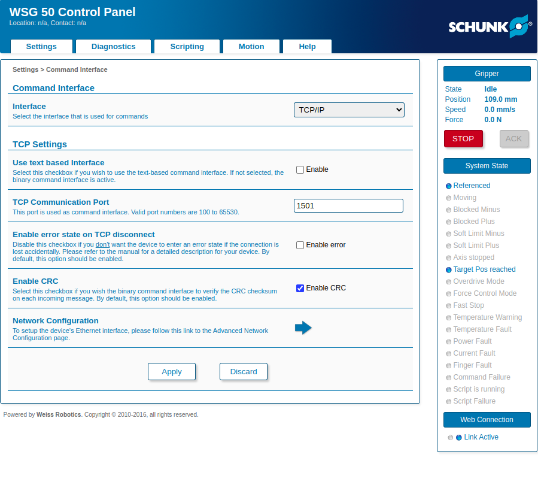

# WSG50 ROS 2 driver

A ROS 2 Humble driver for the SCHUNK/WEISS WSG50 gripper using the binary TCP
command interface. Public ROS values use SI units; conversion to the WSG
protocol's millimetres happens only inside the driver.

The driver does not acknowledge faults, home, or move the gripper at startup
unless the corresponding opt-in parameters are enabled.

## Compatibility

This driver has been built and hardware-tested with:

- ROS 2 Humble
- WSG 50 hardware revision 5
- WSG firmware 4.0.2
- WSG binary command set documented for firmware 4.0.2
- TCP command interface on port 1501 with CRC enabled

Other WSG models and firmware versions have not been tested. The driver does
not use the text interface, Lua scripting interface, or force overdrive mode.

## Gripper configuration

Connect the PC and gripper to the same subnet, then verify the gripper is
reachable. The default launch configuration expects `192.168.1.160`:

```bash
ping 192.168.1.160
```

In the gripper web interface, open **Settings > Command Interface** and select:

- Interface: TCP/IP
- Use text based Interface: disabled
- TCP Communication Port: `1501`
- Enable CRC: enabled



## Build and run

```bash
cd /path/to/wsg50_ros
source /opt/ros/humble/setup.bash
colcon build --symlink-install
source install/setup.bash
ros2 launch wsg50_driver gripper.launch.py gripper_ip:=192.168.1.160
```

Run the launch command in its own terminal. In every other terminal, source the
same ROS and workspace setup before using `ros2`:

```bash
cd /path/to/wsg50_ros
source /opt/ros/humble/setup.bash
source install/setup.bash
```

The safe default startup only connects, configures acceleration/force, and
starts state streaming. Home explicitly before sending a motion goal:

```bash
ros2 service call /wsg50_gripper_driver/ack_fault std_srvs/srv/Trigger '{}'
ros2 service call /wsg50_gripper_driver/home std_srvs/srv/Trigger '{}'
```

Keep the finger workspace clear during homing. Automatic startup acknowledge
and homing can be enabled with `auto_acknowledge_faults:=true auto_home:=true`.

Verify the live state before commanding motion:

```bash
ros2 topic echo --once /wsg50_gripper_driver/state
```

Do not send a motion goal unless the state reports `connected: true` and
`referenced: true`.

## ROS interfaces

The node publishes:

- `~/state` (`wsg50_msgs/msg/State`)
- `~/joint_states` (`sensor_msgs/msg/JointState`)
- `/diagnostics` (`diagnostic_msgs/msg/DiagnosticArray`)

It provides Trigger services on `~/home`, `~/stop`, `~/ack_fault`, and `~/tare`.

### Standard gripper action

`~/gripper_action` uses `control_msgs/action/GripperCommand` and is compatible
with common MoveIt gripper integrations. `position` is the complete jaw gap in
metres. `max_effort=0` performs a normal move; a positive value performs a
grasp using that force in newtons.

```bash
ros2 action send_goal --feedback \
  /wsg50_gripper_driver/gripper_action \
  control_msgs/action/GripperCommand \
  '{command: {position: 0.100, max_effort: 0.0}}'
```

`max_effort=0` selects MOVE. A positive `max_effort` selects GRASP and is the
requested grasp force in newtons:

```bash
ros2 action send_goal --feedback \
  /wsg50_gripper_driver/gripper_action \
  control_msgs/action/GripperCommand \
  '{command: {position: 0.020, max_effort: 10.0}}'
```

### Advanced WSG50 action

`~/command` uses `wsg50_msgs/action/Command` with `MOVE=0`, `GRASP=1`, and
`RELEASE=2`. Width, speed, and acceleration use metres-based SI units; force
uses newtons.

```bash
ros2 action send_goal --feedback \
  /wsg50_gripper_driver/command \
  wsg50_msgs/action/Command \
  '{mode: 0, width: 0.100, speed: 0.010, acceleration: 0.5, force: 10.0, stop_on_block: true}'
```

Examples for all modes:

```bash
# MOVE to a 50 mm complete jaw opening.
ros2 action send_goal --feedback \
  /wsg50_gripper_driver/command wsg50_msgs/action/Command \
  '{mode: 0, width: 0.050, speed: 0.010, acceleration: 0.5, force: 10.0, stop_on_block: true}'

# GRASP an expected 20 mm object with 10 N.
ros2 action send_goal --feedback \
  /wsg50_gripper_driver/command wsg50_msgs/action/Command \
  '{mode: 1, width: 0.020, speed: 0.010, acceleration: 0.5, force: 10.0, stop_on_block: true}'

# RELEASE to a 100 mm complete jaw opening.
ros2 action send_goal --feedback \
  /wsg50_gripper_driver/command wsg50_msgs/action/Command \
  '{mode: 2, width: 0.100, speed: 0.010, acceleration: 0.5, force: 10.0, stop_on_block: true}'
```

A GRASP command expects contact with an object. If no object is present, the
gripper can continue beyond the nominal object width while searching for
contact and then return a command failure. Use MOVE for unloaded positioning.

Only one motion goal runs at a time. Cancellation sends a priority STOP and
waits for the device response. A newer goal stops and preempts the older goal.

Stop motion explicitly with:

```bash
ros2 service call /wsg50_gripper_driver/stop std_srvs/srv/Trigger '{}'
```

## Parameters

| Parameter | Default | Valid range / meaning |
| --- | ---: | --- |
| `gripper_ip` | `192.168.1.160` | Gripper IPv4 address |
| `port` | `1501` | Binary TCP command port |
| `default_speed` | `0.01` | `0.005-0.420 m/s` |
| `default_acceleration` | `1.0` | `0.1-5.0 m/s²` |
| `default_grasp_force` | `40.0` | `5-80 N` |
| `goal_tolerance` | `0.001` | Gap tolerance in metres |
| `state_publish_rate` | `20.0` | ROS publication rate in Hz |
| `auto_acknowledge_faults` | `false` | Opt-in startup acknowledge |
| `auto_home` | `false` | Opt-in startup homing |
| `connect_timeout_ms` | `2000` | TCP connection timeout |
| `response_timeout_ms` | `2000` | Normal command timeout |
| `motion_timeout_ms` | `30000` | Motion completion timeout |
| `reconnect_interval_ms` | `1000` | Reconnect delay |
| `state_update_period_ms` | `50` | Device telemetry period |

Overdrive is intentionally unsupported. On a connection loss, active commands
fail, diagnostics report the error, and the driver reconnects without resuming
motion.

## Tests

```bash
source /opt/ros/humble/setup.bash
colcon test --packages-select wsg50_msgs wsg50_driver wsg50_description
colcon test-result --verbose
```

The transport tests cover known WSG CRC vectors, frame parsing, fragmented TCP
traffic, asynchronous pending/final replies, telemetry dispatch, endian-safe
float handling, and disconnected command cleanup.

## License

Apache License 2.0. See [LICENSE](LICENSE).
